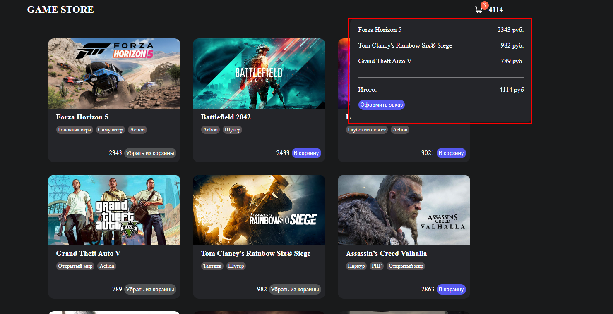

# Проект интернет магазина компьютерных игр.

## Ссылка на демо: https://game-shop-six.vercel.app/

### Стек: React, React-router, React-Toolkit

### Цели проекта: Практика написания React/Redux приложения. Закрытие пробелов в написании Redux логики.

### Итог: Приложение реализованно в дальнейшем планируется расширение функционала.

## В данным момент реализовано:

### Стартовый экран: 

### Главная страница с товарами:

### Страница с детальной информацией об каждой игре:

### Окошко корзины на главной страница:

### Страница оформления заказа:
